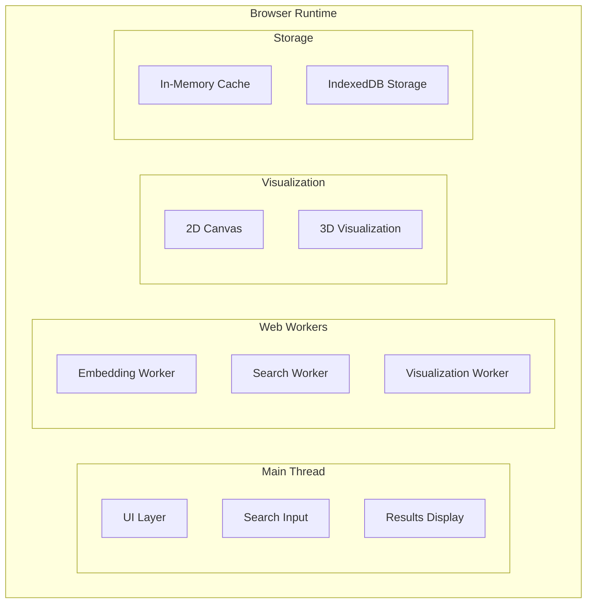

# Browser-Based Semantic Search Visualizer

## Project Goals

A fully client-side semantic search engine that:
- Processes text and generates embeddings entirely in the browser
- Provides interactive visualizations of embedding spaces
- Works offline after initial load
- Demonstrates transformer.js and vector search capabilities

## Architecture Overview



## Key Components

1. **Embedding Worker**
   - Uses transformers.js to run all-MiniLM-L6-v2 model
   - Converts text to 384-dimension vectors
   - WebWorker for non-blocking processing

2. **Search System**
   - Approximate nearest neighbor search
   - Support for large vector indexes
   - Cosine similarity scoring

3. **Visualization**
   - 2D canvas for embedding projection
   - Optional 3D view with Three.js
   - Interactive result exploration

## Development Timeline

| Week | Focus Area              | Deliverables                          |
|------|-------------------------|---------------------------------------|
| 1    | Core Architecture       | Basic embedding + search              |
| 2    | Storage + Visualization | IndexedDB integration, 2D views       |
| 3    | UI Polish               | React components, 3D visualization    |
| 4    | Optimization            | Performance tuning, advanced features |

## Getting Started

1. Clone the repository
2. Run a local server (no build step required)
```bash
python3 -m http.server
```
3. Open `http://localhost:8000/docs` in browser

## Contribution Guidelines

Email anastasia@belenky.net with proposals. PRs welcome for:
- Visualization improvements
- Performance optimizations
- Additional transformer models

## License
AGPL-3.0 - See [LICENSE](/LICENSE)
