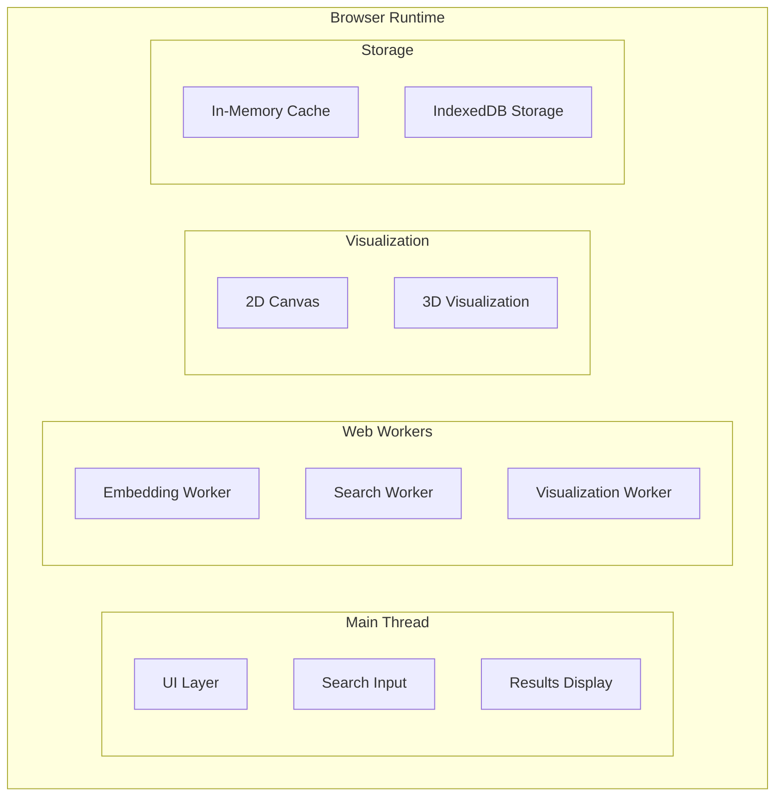

# Browser-Based Semantic Search Visualizer

SUPER in Progress. Everything below is hopes and dreams (:

## Project Goals

A fully client-side semantic search engine that:
- Processes text and generates embeddings entirely in the browser
- Provides interactive visualizations of embedding spaces
- Works offline after initial load
- Demonstrates transformer.js and vector search capabilities

## Architecture Overview (FUTURE)

Note: right now there is no storage or visualization layer, and a single web worker that takes care of all transformers.js operations

## Key Components

1. **Embedding Worker**
   - Uses transformers.js to run all-MiniLM-L6-v2 model
   - Converts text to 384-dimension vectors
   - WebWorker for non-blocking processing

2. **Search System**
   - Approximate nearest neighbor search
   - Support for large vector indexes
   - Cosine similarity scoring

3. **Visualization**
   - 2D canvas for embedding projection
   - Optional 3D view with Three.js
   - Interactive result exploration

## Getting Started

TBD

## Contribution Guidelines

This is a learning project for me, but feel free to use this however you want (according to license) or make PRs if you feel like it. Reach out at anastasia@belenky.net if you have any questions

## License
AGPL-3.0 - See [LICENSE](/LICENSE)
